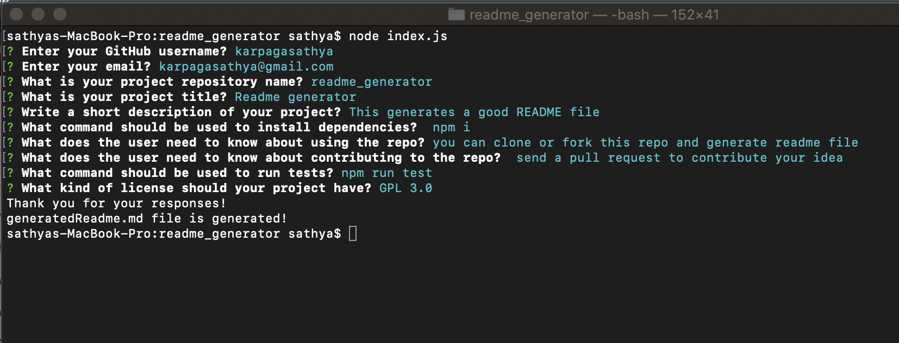

# README Generator

## Description
This README Generator is a command-line application that runs with Node.js which dynamically generates a good README file by answering a few prompts about your project. Node.js and es6+ is used to create this project. It utilizes fs for writing the file, util to promisify the writing of the file and inquirer to ask the questions. Checkout the [`generatedREADME.md`](generatedReadme.md)

## Table of Contents
* [Installation](#installation)

* [Usage](#usage)

* [License](#license)

## Installation

To generate your own README, first run `npm install` in order to install the following npm package dependencies such as:

* [inquirer](https://www.npmjs.com/package/inquirer) that will prompt you for your inputs from the command line.
* [axios](https://www.npmjs.com/package/axios) to fetch your info from the GitHub API

## Usage

* When you run `node index.js`, the application uses the `inquirer` package to prompt you in the command line with a series of questions about your GitHub and about your project.
* The application then takes your responses and uses `axios` to fetch your GitHub profile from the GitHub API, including your GitHub profile picture (avatar) and email. 
* Finally, `fs.writeFile` is used to generate your project's README.md file.

## License

[MIT](License.txt) license

## Demo and Screenshots
[video](images/demo.mov)

